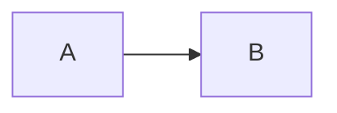
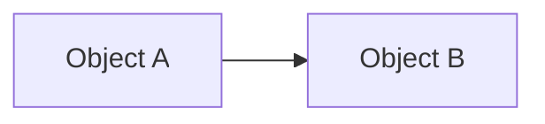
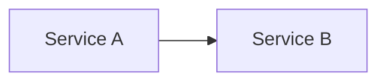

# Mermaid directive DSL

Higher-level fragment scripting for mermaid diagrams. Co-exists with the existing `%%%` post-processing rules and the inline `:::fragidx-N` syntax — directives are an alternative for the common case of "reveal these things in this order, then highlight some of them later."

## Why a directive form

A diagram on a slide is usually told as a narration: "first this, then that, now look at this part." The directive form lets the author write that narration almost verbatim, and the plugin handles the SVG plumbing. It is intended primarily for LLM-assisted authoring — the verbs map cleanly to what the model would say out loud.

Each directive lives in a mermaid comment line beginning with `%%!`. Mermaid ignores them as comments; the plugin parses and acts on them.



## Verbs

Six verbs. Each declares its own propagation rule — no special cases, no surprises.

| Verb | Effect | Target grammar | Edge propagation | CSS class applied |
|---|---|---|---|---|
| `show X at K` | Node X is hidden until step K, then visible | Bare node IDs only (single names, comma list) | Yes — incident edges wait for max(endpoints) | none — uses reveal.js's standard `.fragment` machinery |
| `fragment T at K` | Resolved target T (any atom — node, edge, edge-arrow, edge-label, subgraph cluster) becomes a reveal.js fragment at step K | Full atom grammar (same as `highlight`) | When T is a node, yes (same as `show`); for edges/labels, the post-render fragidx-K tag overrides auto-edge-fragidx for that element | none — uses reveal.js's standard `.fragment` machinery |
| `highlight T at <range>` | T stays visible from start; gains a soft warm halo (drop-shadow glow) plus a small stroke-width bump during the range. Color-agnostic — works regardless of T's existing fill/stroke. | Full atom grammar | No — highlighting says nothing about arc visibility | `.fx-highlight` |
| `dim T at <range>` | T stays visible from start; reduces opacity during the range | Full atom grammar | No | `.fx-dim` |
| `accent T at <range>` | Like `highlight` but with a cool-blue glow — for contrasting two things at once | Full atom grammar | No | `.fx-accent` |
| `spotlight T at <range>` | Inverted-dim model: T gets a strong amber glow **and** every other first-class graphic in the same SVG fades to ~18% opacity. Strongest emphasis verb — "look here, ignore the rest." | Full atom grammar | No | `.fx-spotlight` |

`show` and `fragment` both accept only a plain step `K` (no range modifier). Reveal.js's native fragment system has a single index per element, not a range; "appear from step K to step M only" isn't a thing.

### When to pick which emphasis verb

- **`highlight`** — the everyday "draw the eye here" verb. Soft, warm, unobtrusive. Use it when other elements should remain readable in the periphery.
- **`accent`** — same intensity as `highlight` but cool-blue. Reach for it when the slide already has a `highlight` lit and you want to compare or contrast a second element without color collision.
- **`dim`** — fade something to background. The complement of `highlight` — useful for explicit "this is no longer the topic" cues, not for indirect emphasis.
- **`spotlight`** — the heavy hammer. Use sparingly: at most once or twice per deck, on slides where you genuinely want all other diagram elements to recede. Combines a glow on the target with `:has()`-driven dimming of every other atom in the SVG, so the target jumps off the slide. Overuse defeats it (when everything is spotlit, nothing is).

### `show` vs `fragment` — when to pick which

Both result in fragidx-K on an SVG element, picked up by the same cssIndices pass. Pick by what you're targeting:

- **`show` is the natural verb for "node X appears at step K"** — that's the common slide narration ("first introduce A, then B, then C"). It translates to a mermaid `class X fragidx-K` statement *before* mermaid compiles, which means `class` syntax constraints apply: only bare node IDs, no edges, no labels.
- **`fragment` is the escape hatch for non-node atoms** — `fragment A->B at K` to make an edge appear at K independently of its endpoints, `fragment A->B(label) at K` to fragment just the label, `fragment SubgroupId at K` to fragment a subgraph cluster. It runs after mermaid compiles, so it operates on the full SVG and uses the same atom grammar as `highlight`/`dim`/`accent`.

If you're tagging a node, prefer `show` — it's shorter to read and signals intent ("this thing reveals"). Reach for `fragment` only when `show` can't express the target.

## Range syntax for `highlight` / `dim` / `accent`

| Form | Effect | Mental model |
|---|---|---|
| `at K` | active only when reveal.js's "current fragment" is K | "while we're on this step" — transient, the default |
| `at K+` | active when current step ≥ K | sticky-from |
| `at K-` | active until current step > K (on at slide load) | sticky-to |
| `at K..M` | active when K ≤ current step ≤ M | inclusive closed range |
| `at start` | active only at slide load, fades on first click | transient before any fragment fires |
| `at start+` | always active (slide load through end of slide) | persistent emphasis |
| `at start..K` | equivalent to `at K-` | explicit alternative |

**Indexing.** Reveal.js renormalises `data-fragment-index` values to a contiguous 0-based sequence at runtime — so the K you write is *relative* to other fragments on the slide, not an absolute step number. Whether you write `at 0, 1, 2, 3` or `at 1, 2, 3, 4`, reveal sees four sequential clicks. Use `at start` for "before any click", since reveal's lowest natural index is 0.

**No trailing fade-out click.** Transient `at K` directives use reveal.js's `.current-fragment` class — the directive is active only while its proxy is the current fragment, and reveal automatically drops `.current-fragment` when the user clicks to the next step. So four sequential transients (`at 0, 1, 2, 3`) require exactly four clicks, with the spotlight moving from one node to the next.

**Ranges and sticky-to add a fade trigger.** `at K..M` and `at K-` create an explicit OFF proxy at K+1 / M+1 that may add one extra click if no other fragment lives there. This is the cost of explicit fade-out timing.

## Implementation: how directives become slide events

`show` is a thin pre-compile translator: the plugin rewrites `%%! show A at N` into a mermaid `class A fragidx-N` statement before mermaid compiles. The compiled node SVG carries a `fragidx-N` class, the cssIndices pass turns it into native `.fragment` + `data-fragment-index="N"`, and auto-edge-fragidx propagation makes incident edges wait. No proxy needed.

`fragment` is a post-compile sibling: after mermaid renders, the plugin resolves the target atom against the SVG (same resolver as `highlight`/`dim`/`accent`) and adds `fragidx-K` directly to the resolved element(s). The cssIndices pass then converts that to `.fragment` + `data-fragment-index="K"` exactly as for `show`. The advantage: full atom grammar, so edges, edge-labels, and subgraph clusters are reachable. The cost: targets must exist in the rendered SVG, so typos surface as warnings rather than mermaid parse errors.

`highlight`, `dim`, `accent` use **proxy fragments**. For each directive, the plugin:
1. Tags the resolved target SVG element with a unique `data-fx-id="<unique>"`.
2. Inserts an invisible `<span class="fragment fx-proxy" data-fragment-index="N" data-fx-directive-id="<unique>" data-fx-role="on|off" style="display:none">` next to the SVG in the slide DOM (one or two proxies per directive depending on the range form).

The proxy is a real reveal.js fragment, so it shows / hides on its assigned step like any other. A single listener on `fragmentshown` / `fragmenthidden` / `slidechanged` walks the slide's `.fx-proxy` elements, groups them by target, and computes each target's active class state from proxy visibility.

**Why proxies for the fx verbs:** they integrate with the slide's other fragments at the same `data-fragment-index`. A node-highlight directive at step 3 fires *together with* a code-line highlight at step 3 from `highlight-ace.js`, because both are real reveal.js fragments.

**Why direct (no proxy) for `show` and `fragment`:** "appear at step N" is exactly what `class="fragment" data-fragment-index="N"` on the SVG element does natively. Adding a proxy + listener for that would be code for code's sake.

## Targets

```
target    ::= atom ("," atom)*
atom      ::= name | edge
name      ::= identifier              ; node id or subgraph id from the mermaid source
edge      ::= name arrow name part? qualifier?
arrow     ::= "->" | "-->" | "-.->" | "==>" | "--x" | "--o"
part      ::= "(" ("arrow" | "label") ")"
qualifier ::= "[" "label=" string "]" | "[" int "]"
```

Examples and what they resolve to:

| Target | Resolves to |
|---|---|
| `A` | the node or subgraph named `A` |
| `A, B, C` | three elements |
| `A->B` | every edge from A to B (arrow + label as a unit) |
| `A->B(arrow)` | only the path, not the label |
| `A->B(label)` | only the label, not the path |
| `A-.->B` | only dashed edges from A to B |
| `A==>B` | only thick-arrow edges from A to B |
| `A->B[label="approve"]` | the A→B edge whose label contains "approve" (substring match) |
| `A->B[1]` | the second of multiple A→B edges (0-indexed, document order) |

The arrow style in a target uses mermaid's source syntax. Plain `->` matches *any* arrow style; the others (`-->`, `-.->`, `==>`, `--x`, `--o`) constrain to that specific style.

When a directive's target resolves to multiple elements (e.g. `highlight A->B at 4` with two parallel A→B edges), the verb applies to *all* of them. To act on one, add a qualifier.

## CSS contract

Default styles for the verb classes ship inline with the plugin — `reveal-custom/plugins/mermaid.js` injects them into a `<style>` element at init via the same loader path it uses for KaTeX CSS. The styles are deliberately **color-agnostic**: `highlight` / `accent` / `spotlight` each emit a `filter: drop-shadow(...)` halo plus a stroke-width bump rather than swapping the fill/stroke colour. That way the effect remains visible even when the underlying node already happens to be the same hue as the previous (color-swap based) defaults. `dim` is opacity-based and was already color-agnostic.

Override per deck via CSS variables (most common) or by writing higher-specificity `.fx-<verb> { ... }` rules.

```css
/* defaults — drop-shadow glow + stroke-width bump */
.fx-highlight {
    filter: drop-shadow(0 0 5px var(--fx-highlight-glow, rgba(255, 90, 70, 0.9)));
}
.fx-highlight :is(rect, polygon, ellipse, circle, path),
path.fx-highlight {
    stroke-width: var(--fx-highlight-width, 3px);
}
.fx-accent {
    filter: drop-shadow(0 0 5px var(--fx-accent-glow, rgba(70, 150, 240, 0.9)));
}
.fx-accent :is(rect, polygon, ellipse, circle, path),
path.fx-accent {
    stroke-width: var(--fx-accent-width, 3px);
}
.fx-dim {
    opacity: var(--fx-dim-opacity, 0.35);
}
.fx-spotlight {
    filter: drop-shadow(0 0 7px var(--fx-spotlight-glow, rgba(255, 200, 60, 0.95)));
}
.fx-spotlight :is(rect, polygon, ellipse, circle, path),
path.fx-spotlight {
    stroke-width: var(--fx-spotlight-width, 3px);
}
/* spotlight inverted-dim: every "first-class" graphic in the same SVG that
   isn't the spotlit element (and doesn't contain a spotlit descendant)
   fades to --fx-spotlight-other-opacity */
svg:has(.fx-spotlight)
    :is(g.node, g.cluster, g.edgePath, g.edgeLabel, path.flowchart-link, ...):not(.fx-spotlight):not(:has(.fx-spotlight)) {
    opacity: var(--fx-spotlight-other-opacity, 0.18);
}
```

**Recolour example.** Switch `highlight` from warm-red to lime, give `spotlight` a cyan halo, and lift the dimmed-other opacity:

```css
:root {
    --fx-highlight-glow: rgba(120, 230, 80, 0.9);
    --fx-spotlight-glow: rgba(80, 220, 250, 0.95);
    --fx-spotlight-other-opacity: 0.3;
}
```

**Spotlight scope.** The inverted-dim rule is scoped per-SVG via `:has()`, so multi-diagram slides behave correctly: spotlighting a node in diagram A does *not* dim diagram B. Browser support is Chrome 105+ / Safari 15.4+ / Firefox 121+ — fine for any modern reveal.js deployment.

## Diagram type support

All six verbs (`show`, `fragment`, `highlight`, `dim`, `accent`, `spotlight`) work on:

- **Graph-shaped diagrams** — `flowchart`, `classDiagram`, `erDiagram`, `stateDiagram`. Targets are mermaid source IDs (node names, edge expressions); auto-edge-fragidx propagation makes incident edges wait for both endpoints.
- **`mindmap`** — targets are the source-level identifier (`Frontend`) or the slugified label (`BigRoot` for `root((Big Root))`). Edges are inferred from indentation (`Frontend->React` resolves automatically). Mermaid mindmap rejects `class A fragidx-N` statements, so `show` here routes through post-render fragidx tagging — but the user-visible behavior is the same.
- **`timeline`** — has *no* source identifiers in the SVG, so directives address timeline elements through synthetic structural targets, all 1-based:
  - `section:N` (or `s:N`) — Nth section header. `s:1`, `s:2`, …
  - `period:N` (or `p:N`) — Nth period (taskWrapper) across the whole timeline.
  - `event:N` (or `e:N`) — Nth event (eventWrapper) across the whole timeline.

  Each also accepts a slug instead of a number: `section:MainframeEra`, `period:1950`, `event:VacuumTubes`. Slugs are derived by camelCasing the source label (`"Vacuum tubes"` → `VacuumTubes`).

  **Structural-descendant expansion for `show` / `fragment`**: when you `show section:1`, the section header *and* all its periods, per-period vertical connectors, and events get the same fragidx — the entire column appears together at that step. `show period:3` reveals the period plus its events. The fx verbs (`highlight`, `dim`, `accent`, `spotlight`) are intentionally narrow: they touch only the named element, never its descendants.

  **The horizontal axis arrow is always visible from slide load**, regardless of any `show` directives. The arrow is structural framing — like an X-axis on a plot — so it should orient the viewer before any content lands on it. The plugin recognises mermaid's global axis (a horizontal `<g class="lineWrapper">`) by orientation and excludes it from period-level fragidx tagging.

  Later directives override earlier ones in source order. The natural pattern works as written:

  ```mermaid
  timeline
      section Mainframe Era
          1950 : First computers
          1960 : Transistors
      section Personal Era
          1977 : Apple II
          1981 : IBM PC : MS-DOS
      %%! show section:1 at 1
      %%! show section:PersonalEra at 2
      %%! fragment event:MS-DOS at 7   %% promote MS-DOS to a later step
  ```
- **`sequenceDiagram`** — like timeline, the SVG carries no source-level identifiers for messages or notes (mermaid emits class-only elements: `text.messageText` + `line.messageLine0`/`line.messageLine1` for arrows, `path.messageLine*` for self-message curves, `g` wrapping `rect.note` + `text.noteText` for notes, `rect.actor.actor-top`/`actor-bottom` + matching `text.actor.actor-box` + `.actor-line` for participants, `polygon.labelBox` + `text.labelText` per labeled block, `text.loopText` per branch caption, `rect.activation0` per activation). Targets are addressed through synthetic structural keys, all 1-based by source order:
  - `msg:N` (or `m:N`) — Nth message in source order. Resolves to the arrow line (or curved path for self-messages) **and** its label text — they're treated as one cohesive unit, so the label always animates with its arrow.
  - `actor:N` (or `a:N`) — Nth participant in source order. Resolves to the lifeline + the top and bottom rects + matching text labels (rects are positioned at the lifeline's x). Also accepts the participant's source id (`actor:App`) and the slugified `as` label (`actor:YourApplication` for `participant App as Your Application`).
  - `note:N` (or `n:N`) — Nth note (`Note over A: text`, `Note left/right of A: text`) in source order. Resolves to the wrapping `<g>` + its `rect.note` + its `text.noteText`.
  - `loop:N` / `alt:N` / `opt:N` / `par:N` / `critical:N` / `break:N` / `rect:N` — Nth block of that type in source order. Resolves to the block's label box + label text + every branch caption (main + `else` / `and` / `option`) + every message + note + activation **inside** the block (transitively across nested blocks). The natural verb for "reveal this whole region of the conversation at once."
  - `block:N` (or `b:N`) — type-agnostic Nth block, indexing across all block types in source order. Equivalent to whatever `loop:N` / `alt:N` / etc. would have addressed — pick whichever reads better for the slide.
  - `activation:N` (or `act:N`) — Nth activation rectangle (`activate A`) in source order. Useful when a `%%! show msg:K` should also reveal the activation that bracket-encloses the message.

  Each also accepts a slug derived from the message label / note text. The everyday way to address messages is by index (`msg:1`, `msg:2`, …) — far less brittle than slugs against editorial tweaks.

  **Edge-style `A->B` atoms for messages.** Atoms like `App->API` resolve to messages from actor `App` to actor `API` in source order. `App->>API` constrains to the sync-arrow style; `App-->>API` to the dashed response style; `App->API` is the wildcard. `[N]` qualifier picks the Nth match (0-based, source order) when multiple A→B messages exist; `[label="..."]` matches a substring of the message label. The arrow set understood for sequence: `->>`, `-->>`, `->`, `-->`, `-x`, `--x`, `-)`, `--)`.

  **No structural descendants** for sequence: `show actor:1 at 3` reveals the actor itself (lifeline + rects + labels) but not the messages that connect to it. Messages are independent atoms, addressed separately. This keeps the source narration explicit ("show this actor, then show the first message, then show the second…") instead of having one click trigger a cascade the author may not have intended.

  ```mermaid
  sequenceDiagram
      participant App as Your Application
      participant API as LLM API Endpoint
      App->>API: POST /chat/completions
      API-->>App: response
      Note left of API: usage tokens
      %%! show msg:1 at 1
      %%! show msg:2 at 2
      %%! show note:1 at 2
      %%! highlight actor:API at 3
  ```

  Block example — show the whole loop region as one click, then highlight the timeout branch of a critical block:

  ```mermaid
  sequenceDiagram
      participant U as User
      participant A as Agent
      U->>A: query
      loop until success
          A->>A: think
          A-->>U: progress
      end
      critical safe operation
          A->>U: result
      option timeout
          A->>U: fallback
      end
      %%! show msg:1 at 1
      %%! show loop:1 at 2
      %%! show critical:1 at 3
  ```

- **`gantt`** — tasks already carry source-level ids on the rect (`<rect id="a1">`), and labels are paired by `<text id="<id>-text">`. Directives can address tasks by source id, by index, or by slugified label:
  - **Bare source id** — `a1`, `m1`, etc. The most direct form when tasks have explicit ids.
  - `task:N` (or `t:N`) — Nth task across the whole gantt in DOM order (which matches source order). Slug form: `task:Build` for label "Build".
  - `milestone:N` (or `m:N`) — Nth milestone (subset of tasks where the source line carries the `milestone` keyword).
  - `section:N` (or `s:N`) — Nth section header. Also accepts a slug derived from the section name (`section:Phase1`).

  **Structural-descendant expansion**: `show section:N` and `fragment section:N` cascade to the section's stripe rects, every task in the section, and each task's label. The fx verbs (`highlight`, `dim`, `accent`, `spotlight`) act only on the section title text — narrow by design.

  ```mermaid
  gantt
      title Project Plan
      dateFormat YYYY-MM-DD
      section Phase 1
      Design  : a1, 2024-01-01, 5d
      Build   : a2, after a1, 3d
      section Phase 2
      Test    : c1, 2024-01-10, 4d
      Release : milestone, m1, 2024-01-15, 0d
      %%! show a1         at 1
      %%! show task:2     at 2
      %%! show section:2  at 3
      %%! highlight m1    at 4
  ```

- **`sankey`** — nodes are deduped by first-appearance source order and rendered as `<g class="node" id="node-N">`; their labels live in a parallel `<g class="node-labels">` in the same order. Flows are `<g class="link">` in source order. Targets:
  - **Bare node name** — `Coal`, `Electricity`, etc. The label animates as a co-element.
  - `flow:N` (or `f:N`) — Nth flow in source order.
  - `Source->Target` edge atom — resolves through the canonical edge resolver, including `[N]` qualifier when multiple flows share the same endpoint pair (rare in sankey).

  ```mermaid
  sankey-beta
  Coal,Electricity,40
  Gas,Electricity,30
  Electricity,Industry,35
  Electricity,Homes,25
  %%! show Coal at 1
  %%! show flow:1 at 2
  %%! show Electricity at 3
  %%! highlight Electricity->Industry at 4
  ```

- **`gitGraph`** — commits, branches, and tags don't carry stable source ids on their SVG attributes (the auto-generated id of a merge circle changes between runs), so directives address them through synthetic keys built from source-order parsing:
  - `commit:N` (or `c:N`) — Nth commit in source order, including merge commits. Resolves to the outer circle + (when present) the `commit-merge` inner circle + the matching `commit-label` rect/text. Also accepts the user-given commit id: `commit:init`, `commit:v1`.
  - `merge:N` — Nth merge commit specifically (subset of commits authored as `merge X`).
  - `branch:N` / `branch:<name>` — Nth branch in source order. Branch 1 is the implicit `main`/`master`; subsequent branches follow source order. Resolves to the branch line + matching label group + label background.
  - `tag:N` / `tag:<name>` — Nth tag in source order. Resolves to the polygon background + circle hole + label text.
  - `arrow:N` — Nth connector path between commits. Rarely needed — commits drive the staging in most decks. Use this only when an arrow needs a different fragidx than its endpoint commit.

  ```mermaid
  gitGraph
      commit id: "init"
      commit id: "v1"
      branch develop
      checkout develop
      commit id: "feat-a"
      checkout main
      merge develop
      commit id: "v2" tag: "v2.0"
      %%! show commit:init     at 1
      %%! show branch:develop  at 2
      %%! show commit:feat-a   at 3
      %%! show merge:1         at 4
      %%! highlight tag:v2.0   at 5
  ```

For pie and journey: directives are parsed but no resolver is implemented — only `show` against bare node names works on pie (via mermaid `class` statements). `fragment`, `highlight`, `dim`, `accent`, `spotlight` on those types need diagram-specific resolvers and remain out of scope. Use `%%%` selector rules as the escape hatch.

## State diagram quirk

State diagrams emit transition IDs as `edge0`, `edge1`, … with no endpoint information in the SVG id. The directive resolver works around this by parsing the source for transition order and pairing by index. So `Idle->Running` resolves correctly even though the SVG path id is opaque. (This mirrors how the verifier already handles state diagrams.)

## Comparison with `%%%` rules

`%%%` rules target raw SVG selectors and apply CSS classes / attributes verbatim. They remain the escape hatch for:

- diagram types whose directive resolver is not yet implemented (pie, journey)
- modifying SVG attributes other than classes (`[data-foo=bar]`) or applying non-fragidx classes (`.neon`, `.grow`, `.fade-up`)
- targeting elements no synthetic key reaches (e.g. activation rectangles, loop frames in sequence diagrams)

For everything else — flowchart, classDiagram, erDiagram, stateDiagram, mindmap, timeline, sequenceDiagram, gantt, sankey, gitGraph — directives are the recommended path. They speak in mermaid source IDs and synthetic structural keys, count cleanly against `[NEXT FRAGMENT]` markers, and don't break when the diagram is edited.

## Worked example

The narration "show A, then show B with the arc, then highlight A, then highlight the arc" maps to:



Step-by-step rendering:

| Step | Visible / state |
|---|---|
| 0 (slide load) | nothing |
| 1 | A appears |
| 2 | B appears + arc A→B appears (auto-propagated) |
| 3 | A is highlighted (red stroke) |
| 4 | arc A→B is highlighted |

A `fragment`-using example — when the edge needs to appear *separately* from its endpoints (e.g. you've already shown both nodes, then introduce a new relationship between them):



Without the `fragment` directive, auto-edge-fragidx would put the arc at step 1 (max of endpoints), making it appear together with B. With it, the arc waits for step 2.
